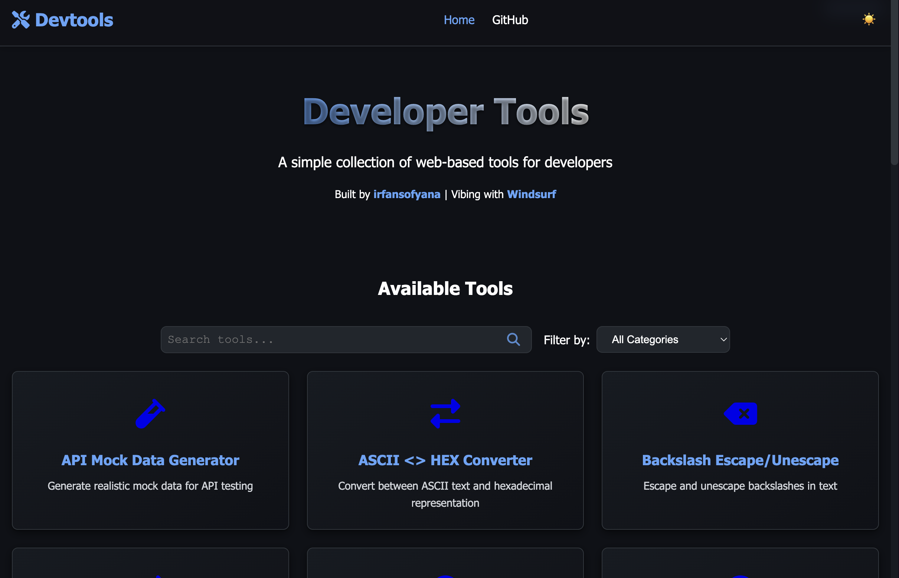

# Devtools

A comprehensive collection of web-based tools for developers. This project provides a toolkit that developers can access via GitHub Pages to perform common development tasks more efficiently.



## 📋 Table of Contents

- [Overview](#-overview)
- [Available Tools](#-available-tools)
- [Features](#-features)
- [Installation](#-installation)
- [Usage](#-usage)
- [Project Structure](#-project-structure)
- [Contributing](#-contributing)
- [License](#-license)
- [Troubleshooting](#-troubleshooting)

## 🔍 Overview

Devtools is designed to streamline common development tasks by providing a suite of web-based utilities that can be accessed directly from your browser. Whether you're working on front-end, back-end, or DevOps tasks, these tools help you save time and improve productivity.

## 🧰 Available Tools

1. **API Mock Data Generator** - Generate realistic mock data for API testing
2. **ASCII <> HEX Converter** - Convert between ASCII text and hexadecimal representation
3. **Backslash Escape/Unescape** - Escape and unescape backslashes in text
4. **Base64 Encoder/Decoder** - Encode and decode text using Base64 encoding
5. **Color Converter** - Convert between HEX, RGB, and HSL color formats
6. **Crontab Generator** - Create crontab expressions visually with human-readable descriptions
7. **CSV <> JSON Converter** - Convert between CSV and JSON data formats
8. **CURL Constructor** - Build CURL commands for terminal execution with customizable options
9. **Hash Generator** - Generate MD5, SHA-1, SHA-256, and SHA-512 hashes
10. **JSON Beautifier/Minifier** - Format and compress JSON with syntax highlighting
11. **JSON to Protobuf** - Generate Protocol Buffer definitions from JSON examples
12. **JSON <-> YAML Converter** - Two-way conversion between JSON and YAML formats with validation
13. **JSON/YAML Explorer** - Visualize and explore JSON and YAML data with interactive tree view
14. **JWT Decoder** - Decode and inspect JSON Web Tokens (JWT)
15. **Line Sort/Dedupe** - Sort lines alphabetically and remove duplicates
16. **Markdown Preview** - Preview Markdown with live rendering
17. **Mermaid Diagram Editor** - Create diagrams with Mermaid syntax and live preview
18. **OCR Tool** - Extract text from images and PDFs using offline OCR
19. **QR Code Reader/Generator** - Generate QR codes from text or URLs, and scan QR codes from images
20. **Random Password Generator** - Generate secure random passwords with customizable options
21. **Random String Generator** - Generate random strings with patterns and custom options
22. **Regular Expression Tester** - Test and validate regular expressions with live results
23. **String Case Converter** - Convert between camelCase, snake_case, kebab-case and more
24. **Text Diff Utility** - Compare two text blocks and highlight differences
25. **Timestamp Converter** - Convert between various timestamp formats and human-readable dates
26. **URL Encoder/Decoder** - Encode and decode URLs and URL components
27. **URL Parser** - Parse and extract components from URLs
28. **URL to Markdown** - Scrape URL content and convert to Markdown format
29. **UUID Generator** - Generate random UUIDs in version 4 format

## ✨ Features

- 🌙 **Dark/Light theme support** - Comfortable viewing in any environment
- 📱 **Responsive design** - Works on mobile, tablet, and desktop devices
- 🔄 **Copy-to-clipboard functionality** - Easy transfer of results
- ⚡ **Client-side processing** - No server requirements, works offline
- 💾 **Local storage** - Save your work and preferences between sessions
- 🔒 **Privacy-focused** - No data leaves your browser
- ♿ **WCAG accessibility compliance** - Usable by everyone
- 🌐 **Offline support** - Works without an internet connection
- 🔍 **Search functionality** - Quickly find the tool you need

## 📥 Installation

### Local Development

1. Clone the repository:

   ```bash
   git clone https://github.com/irfansofyana/devtools.git
   cd devtools
   ```

2. Open the project in your favorite code editor

3. To view the tools locally, simply open the `index.html` file in your browser

### Production Deployment

1. The project is static HTML/CSS/JavaScript and can be deployed directly

2. Deploy the project files to your web server or GitHub Pages

## 🚀 Usage

### Basic Usage

1. Navigate to the deployed website or your local development server
2. Select a tool from the navigation menu
3. Input your data in the provided fields
4. View the results and use the copy button to transfer to clipboard

### Example: Using the JSON Beautifier

1. Navigate to the JSON Beautifier tool
2. Paste your minified JSON into the input field
3. Click the "Beautify" button
4. The formatted JSON will appear in the output field
5. Use the "Copy" button to copy the result to your clipboard

## 📁 Project Structure

```plaintext
devtools/
├── assets/            # Static assets (images, icons, etc.)
├── css/               # Stylesheet files
├── js/                # JavaScript files
│   ├── tools/         # Individual tool implementations
│   ├── utils/         # Utility functions
│   └── app.js         # Main application script
├── index.html         # Main HTML entry point
├── .gitignore         # Git ignore file
├── CONTRIBUTING.md    # Contribution guidelines
├── LICENSE            # MIT License
└── README.md          # Project documentation
```

## 👥 Contributing

We welcome contributions from the community! Please see our [CONTRIBUTING.md](CONTRIBUTING.md) file for detailed information on how to contribute to this project.

## 📄 License

This project is licensed under the MIT License - see the [LICENSE](LICENSE) file for details.

## ❓ Troubleshooting

### Common Issues

1. **Tool not working properly**
   - Check your browser console for errors
   - Try clearing your browser cache
   - Ensure you're using a modern browser (Chrome, Firefox, Safari, Edge)

2. **Tools not loading properly**
   - Check your browser console for JavaScript errors
   - Ensure all files are properly downloaded
   - Try using a different browser

3. **Changes not appearing after deployment**
   - Ensure your browser isn't serving cached content
   - Verify the deployment process completed successfully
   - Check that all assets were properly uploaded

For additional help, please [open an issue](https://github.com/irfansofyana/devtools/issues) on GitHub.
