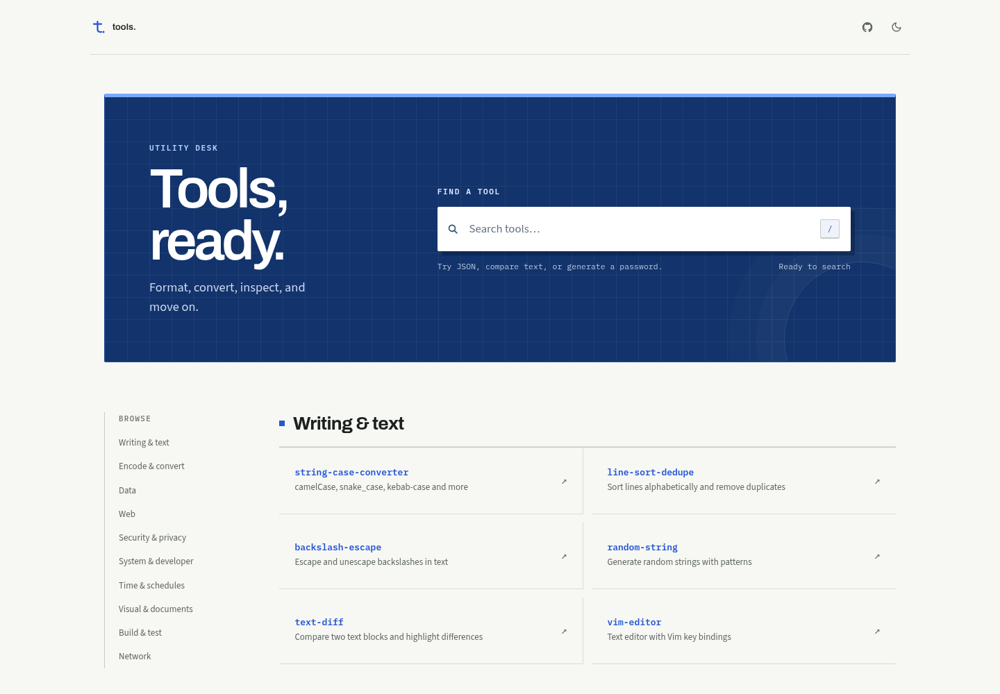

# tools.

A focused collection of browser utilities for the small digital jobs that should not need an account, an install, or a heavyweight app.

**Live:** [tools.irfansp.dev](https://tools.irfansp.dev) · **Tools:** 43 · **Stack:** vanilla HTML, CSS, and JavaScript

[](https://tools.irfansp.dev)

## What is here

- **Writing and text** — case conversion, sorting, escaping, diffing, and a Vim editor
- **Encoding and conversion** — Base64, URLs, HTML entities, ASCII, hex, CSV, JSON, YAML, XML, and SQL
- **Security and privacy** — hashes, HMAC, UUID/ULID, passwords, and encrypted secret sharing
- **Visual and documents** — QR codes, Markdown, Mermaid, OCR, colors, and ASCII art
- **Developer and network** — API mocks, regex, timestamps, cron, IP lookup, TLS checks, and subnet calculations

The homepage is built for quick retrieval: search by tool name or task, use `/` or `Ctrl/Cmd + K` to focus search, then use the arrow keys and Enter to open a result.

## Product principles

- **Fast to enter, fast to leave.** The interface stays out of the task.
- **No sign-in.** Open a tool and use it immediately.
- **Local where practical.** Most transformations happen in the browser. Network tools and some library-backed tools may call external services or CDNs; each tool should be treated according to what it actually does.
- **Works across themes and screen sizes.** The shared workbench supports light/dark modes, keyboard navigation, and responsive layouts.
- **No framework tax.** The project remains deployable as static files.

## Run locally

```bash
git clone https://github.com/irfansofyana/tools.git
cd tools
python3 -m http.server 4173
```

Open [http://localhost:4173](http://localhost:4173).

## Test

The regression suite uses Node's built-in test runner—no install step required.

```bash
node --test tests/*.test.mjs
```

## Structure

```text
.
├── index.html              # Searchable tool catalog
├── tools/                  # 43 standalone tool pages
├── css/
│   ├── styles.css          # Tokens, reset, and typography
│   ├── theme.css           # Light and dark palettes
│   ├── layout.css          # Page shell and responsive layout
│   ├── components.css      # Shared controls and feedback
│   └── workbench.css       # Catalog and tool-workspace system
├── js/
│   ├── main.js             # Shared tool-page enhancements
│   ├── search.js           # Filtering and keyboard navigation
│   └── theme.js            # Theme persistence
├── assets/                 # Logo, favicon, and screenshots
└── tests/                  # Static and behavior regressions
```

## Add a tool

1. Add the standalone HTML page under `tools/`.
2. Load the shared styles in this order: `styles.css`, `theme.css`, `layout.css`, `components.css`, `workbench.css`.
3. Add the tool to the matching category in `index.html`.
4. Keep the page usable with a keyboard and in both themes.
5. Update the tool count and run the tests.

See [CONTRIBUTING.md](CONTRIBUTING.md) for the full contribution workflow.

## License

[MIT](LICENSE)
